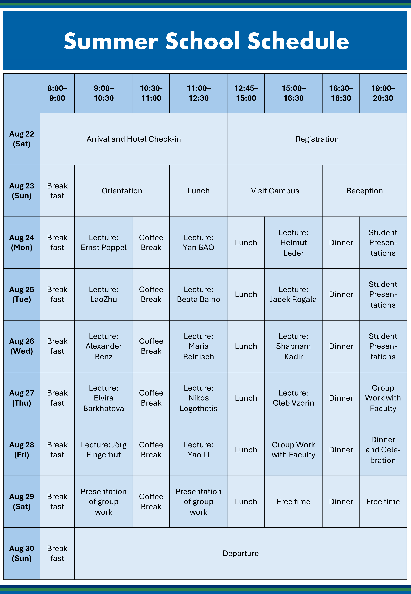

## 项目简介

SISU-LMU-VDW 2026 暑期学校“美学的力量”将于 2026 年 8 月 22 日至 30 日在上海外国语大学举办。本次暑期学校面向国内外本科生、研究生、博士后及青年学者开放，旨在通过跨学科讲座、学术讨论、学生报告与小组合作，推动围绕美学、神经美学、人类认知与创造力的国际学术交流。

本次暑期学校主题为“美学的力量”，将第三次在上海举办。项目以神经美学前沿研究为重要基础，同时邀请来自脑科学、心理学、图像科学、艺术史、哲学、语言学、建筑、管理学等不同领域的专家来沪授课，并与学员围绕美学、人类认知、创造力与跨文化理解等主题展开深入讨论。

暑期学校采用国际化师生研讨方式进行，鼓励来自不同国家、地区和学科背景的师生充分交流。学员将通过专题讲座、学术讨论、学生报告和小组合作等形式，拓展对“美学”及其相关问题的理解，并在跨学科环境中形成新的研究视角。

## 组织单位

本次暑期学校由以下单位组织：

- 上海外国语大学零点实验室（Neurocognitive Image Laboratory, NIL）与世界艺术史研究所（World Arthistory Institute, WAI）
- 德国慕尼黑大学医学心理学研究所（Institute of Medical Psychology, IMP, Ludwig Maximilian University, LMU）
- 德国科学家协会（Federation of German Scientists, VDW, Vereinigung Deutscher Wissenschaftler）

## 师资与讲座主题

本次暑期学校将邀请来自神经科学、心理学、实证美学、艺术史、哲学、语言学、建筑、管理学等领域的专家学者参与授课与讨论。

## 初步日程

本次暑期学校将包括报到注册、开营导览、专题讲座、学术讨论、学生报告、小组合作、成果展示与离会等环节。

具体日程可能根据组织安排适当调整。

## 报名对象

本次暑期学校面向各国学术机构在读学生及青年研究者开放，包括：

- 本科生
- 硕士研究生
- 博士研究生
- 博士后
- 青年学者

不限性别与国籍。申请人原则上年龄在 40 周岁以下。学员需在暑期学校期间全程线下参与所有活动，积极参与讨论，并在暑期学校结束后按要求完成论文写作或相关研究任务。

## 报名方式

申请人需提交以下英文材料：

- 英文 motivation letter
- 英文 CV

请将申请材料发送至 [nil@shisu.edu.cn](mailto:nil@shisu.edu.cn)，并抄送 [baoyan@pku.edu.cn](mailto:baoyan@pku.edu.cn) 与 [Ernst.Poeppel@med.uni-muenchen.de](mailto:Ernst.Poeppel@med.uni-muenchen.de)。

报名截止时间：2026 年 6 月 30 日 24:00。

## 遴选原则

三方组织者将参考主讲教授意见，综合评判最终邀请参加的学员。遴选依据包括申请人已有学术成果、学科背景与暑期学校主题的契合程度、可能为暑期学校研讨带来的贡献，以及不同国家、地区和学术背景之间的交流潜力。

如有必要，组织方将在简历筛选后通过面试方式进一步遴选参与者。面试安排将以邮件形式通知。

## 费用与支持

本次暑期学校不收取学费。主办方将为学员提供暑期学校期间的统一食宿。

## 结业证书

参加暑期学校的学员有机会获得由德国慕尼黑大学医学心理学研究所（Institute of Medical Psychology, IMP）和慕尼黑大学（Ludwig Maximilian University of Munich, LMU）颁发的暑期学校结业证书。

## 招募海报

[下载官方招募海报](NIL-2026-Summer-School-Flyer.pdf)
